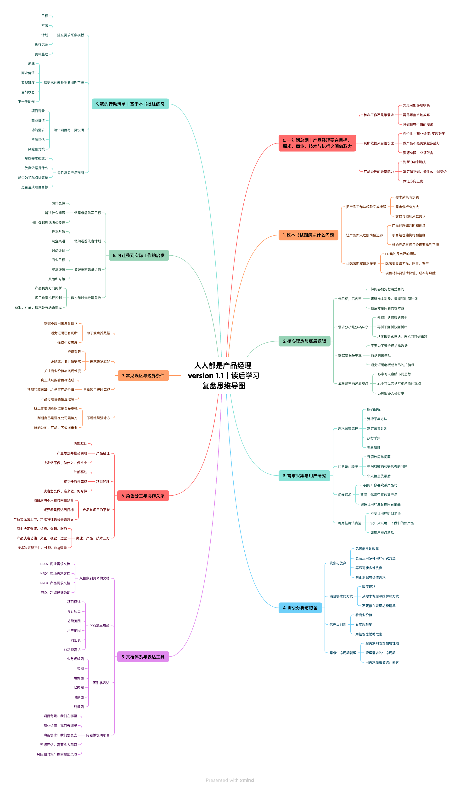

# obsidian-reading-map-skill

把 Obsidian / Apple Books 导出的读书批注 Markdown，整理成可导入 XMind 的“读后学习复盘思维导图”。

## 适用场景

- 你有一本书的 Obsidian Markdown 批注文件。
- 你希望导图不是章节摘要，而是“读完一本书后可复习、可迁移、可行动”的结构。
- 你希望优先保留自己的高亮、笔记、重复标记和明确强调内容。
- 你希望输出 XMind 可导入的 OPML，并可选生成 XMind MCP 在线导图。

## 仓库内容

```text
obsidian-reading-map/
├── SKILL.md
├── agents/
│   └── openai.yaml
├── references/
│   └── opml-format.md
└── assets/
    ├── everyone-pm-reading-map.png
    └── inspired-reading-map.png
```

## Skill 名称

`obsidian-reading-map`

## 在 Codex 中使用

### 1. 安装到本地 Codex skills 目录

把仓库里的 `obsidian-reading-map` 文件夹复制到本地 Codex skills 目录：

```bash
cp -R obsidian-reading-map ~/.codex/skills/
```

如果之前已经安装过同名 skill，先删除旧目录或覆盖更新。

### 2. 在 Codex 中调用

新开一个 Codex 会话，或重启 Codex 后，可以这样说：

```text
使用 $obsidian-reading-map，把这本 Obsidian 读书批注生成 XMind 可导入 OPML。
```

也可以直接提供批注文档路径：

```text
使用 $obsidian-reading-map，读取 /path/to/book-highlights.md，生成 XMind 可导入 OPML。
```

### 3. 推荐输入

- Obsidian Markdown 批注文档
- Apple Books 导出的 highlights / annotations Markdown
- 用户额外说明的处理原则、示例图或已有 OPML

### 4. 预期输出

- 一个 XMind 可导入的 `.opml` 文件
- 如已配置 XMind MCP，可选生成 XMind 在线导图链接
- 简短校验结果：批注数量、节点数量、一级分支数量、XML 是否有效

## 固化的处理原则

- 优先保留用户高亮、笔记、重复标记或明确强调的内容。
- 先去重，再归类，再重组，不按原文阅读顺序平铺。
- 可以用目标书本身的公认核心框架补全逻辑闭环。
- 不混入其他书籍、外部文章或泛化经验观点。
- 不确定是否属于原书观点时，默认不写。
- 必须形成“核心问题 → 核心观点 → 方法框架 → 工作流程 → 常见误区 → 实践迁移”的复盘闭环。
- 默认增加“我的行动清单”，但要标明是基于本书批注或本书方法练习。

## 默认输出

1. XMind 可导入 `.opml` 文件。
2. 可选 XMind MCP 在线导图链接。
3. 校验结果：批注数量、导图节点数、一级分支数、XML 是否有效。
4. 如有外部书籍或不确定观点，会说明已排除。

## 示例效果

### 《人人都是产品经理 version 1.1》



### 《启示录：打造用户喜爱的产品》


## 设计取舍

这个 skill 不绑定某一本书，也不内置固定生成脚本。它固化的是“批注到学习复盘导图”的工作流和质量标准。每次处理具体书籍时，Codex 应根据该书批注和该书事实观点重新组织结构。
